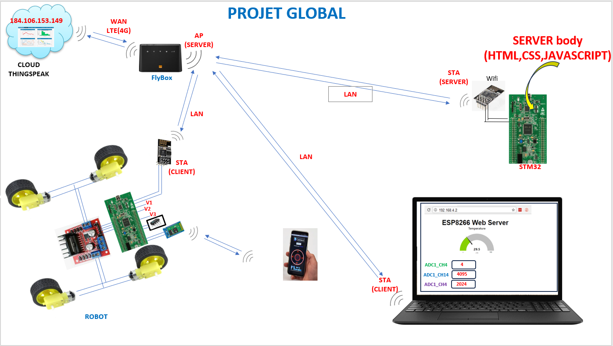

## 📚 Overview
This repository contains two implementations of a 4WD Robot system using the STM32F407VG microcontroller: one using **bare-metal programming (direct register access)** and another using the **STM32 HAL** framework.

  

The system includes modular sensor acquisition and cloud connectivity:
- Sensor data is acquired using the **ADC in DMA mode** for efficient analog signal sampling.
- Temperature readings are obtained via **I2C communication** from a **DS1621** digital temperature sensor.
- Wi-Fi communication is handled by an **ESP8266 module**, enabling **cloud upload (ThingSpeak)** and **web-based monitoring**.

### Technical Summary
- **Microcontroller Board:** STM32F407VG Discovery  
- **Development Approach:** Hybrid  
  - **Bare-Metal Version:** Complete implementation (BLE control, cloud and local web server communication)  
  - **HAL Version:** Focused on cloud communication and monitoring interface (BLE control not included)

### Features
- Motor control via PWM  
- Sensor data acquisition  
- Wi-Fi communication with ESP8266  
- Cloud data upload (ThingSpeak)  
- Web-based monitoring interface  

## 📦 Project Structure
- `src/` – Source code  
- `inc/` – Header files  
- `images/` – Diagrams and architecture images  

## 📌 Notes
- The original **bare-metal version** includes full robot control (including BLE commands such as forward, backward, etc.), and supports both cloud and local web server communication.  
- The **HAL version** reuses parts of the original structure, focusing on cloud upload and monitoring, but **does not include** BLE-based robot command control.
